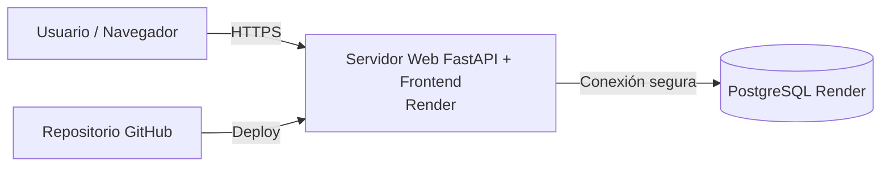

# MANUAL TÉCNICO – AGENDA CLOUD DE CONTACTOS

## 1. Descripción funcional de la aplicación
La aplicación permite administrar una agenda de contactos por medio de dos entidades principales: **grupos** y **personas**. Cada persona pertenece obligatoriamente a un grupo, mientras que un grupo puede tener muchas personas asociadas.

### Funcionalidades implementadas
- Registro de grupos.
- Edición de grupos.
- Listado de grupos.
- Registro de personas.
- Edición de personas.
- Listado visual de personas con fotografía.
- Manejo del estado activo/inactivo.
- Uso de UUID como identificador interno.

## 2. Arquitectura
La solución fue desarrollada con una arquitectura frontend/backend.

### Frontend
Construido con HTML, CSS y JavaScript. Se encarga de:
- Mostrar formularios de registro y edición.
- Mostrar la lista de grupos.
- Mostrar tarjetas visuales de personas con fotografía.
- Consumir la API REST del backend.

### Backend
Construido con FastAPI y SQLAlchemy. Se encarga de:
- Exponer servicios REST.
- Validar los datos.
- Registrar y actualizar información.
- Conectarse a PostgreSQL.
- Generar UUID para los registros.

### Base de datos
PostgreSQL almacena la información de grupos y personas.

## 3. Punto 3 – Despliegue en proveedor Cloud
Proveedor recomendado: **Render**.

Servicios utilizados:
- **Web Service** para alojar el backend y servir el frontend.
- **PostgreSQL administrado** para la persistencia de datos.
- **GitHub** como repositorio de código fuente e integración de despliegue.

## 4. Punto 4 – Diagrama de red

## 5. Link de GitHub
Reemplazar con el enlace real del repositorio del grupo:

`https://github.com/USUARIO/REPOSITORIO`
